<table>
<tr>
<td width="148"></td>
<td>

# Serialist

A native, GPU-rendered serial terminal built on [GPUI](https://gpui.rs), the UI framework
behind the Zed editor. macOS first, Linux and Windows from the same code.

</td>
</tr>
</table>

- Devices appear the moment they are plugged in. TCP streams and recorded captures open in
  tabs like ports, and a capture replays at its original pace.
- Any baud rate, full framing and flow control, per-device profiles.
- Saved commands you send with a click or a key, or inline mode, where every keystroke goes
  to the port.
- A monitor log of every line, or VT mode for U-Boot menus and Linux consoles.
- Lua scripting, and protocol plugins you install (an Airoha RACE example ships with the app).
- Fonts and themes the way Zed does it; Zed theme files load unchanged.
- No dropped bytes at 12 Mbaud, frames under 8 ms at a million lines of scrollback.
- Every test runs without hardware, and CI fuzzes the parsers, codecs and config loaders
  (`CONTRIBUTING.md`).


Serialist Dark, on a simulated device that never stops talking. Docks on the left, the log
in the middle, the port and its live byte rates in the status bar.

<table>
<tr>
<td width="50%" valign="top">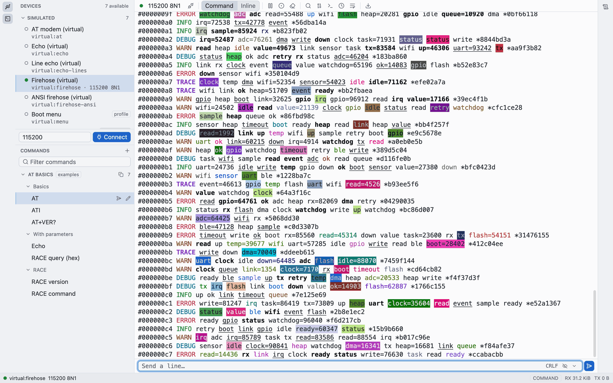<br><sub><b>Light and dark.</b> The same session in Serialist Light. The theme follows the system, or you pin one.</sub></td>
<td width="50%" valign="top">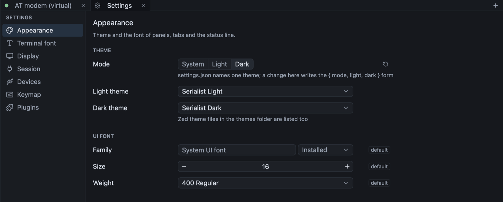<br><sub><b>Settings</b> open in a tab (<code>cmd-,</code>): mode, themes, fonts, device profiles and the keymap, written back to <code>settings.json</code> one key at a time.</sub></td>
</tr>
<tr>
<td width="50%" valign="top">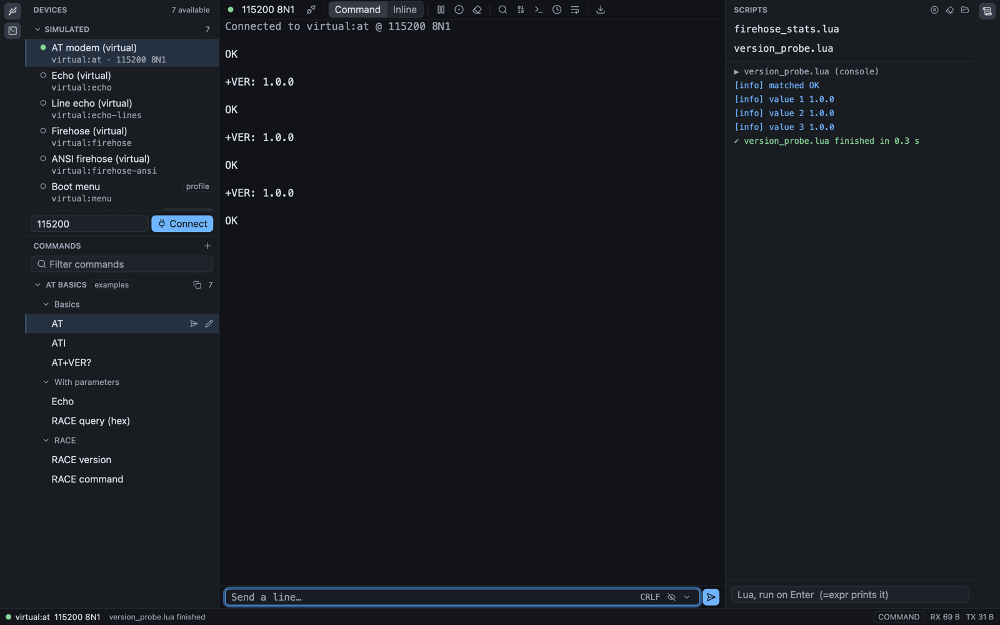<br><sub><b>Lua scripts</b> run against the open session; the Script console shows what they print. Saved commands sit in the left dock.</sub></td>
<td width="50%" valign="top">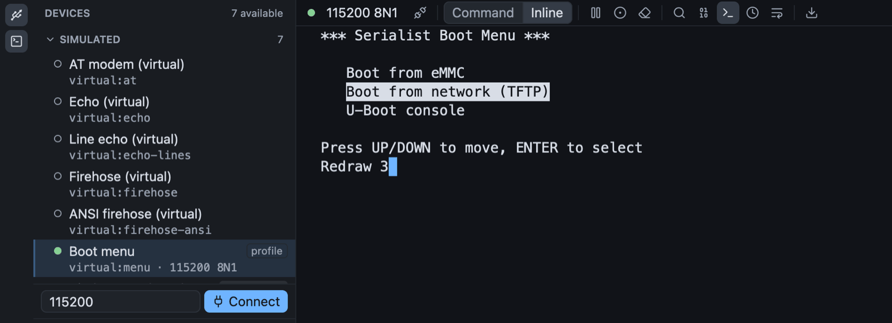<br><sub><b>VT mode</b> draws what a device paints with cursor addressing, here a U-Boot style boot menu (the <code>menu</code> simulated device).</sub></td>
</tr>
<tr>
<td width="50%" valign="top">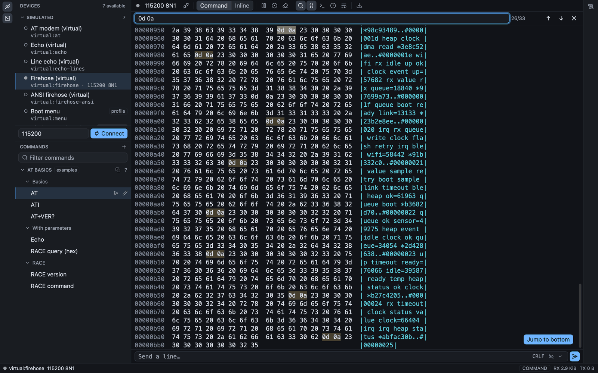<br><sub><b>Search and hex.</b> Search the scrollback as text or bytes; the hex view shows the same bytes with every match lit.</sub></td>
<td width="50%" valign="top">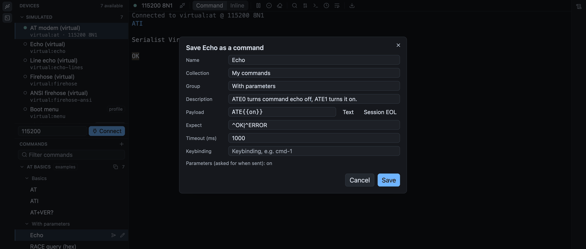<br><sub><b>Saved commands</b> take parameters, an expected reply and a key. They live in JSON collections under the config directory.</sub></td>
</tr>
</table>

<table>
<tr>
<td width="25%" valign="top">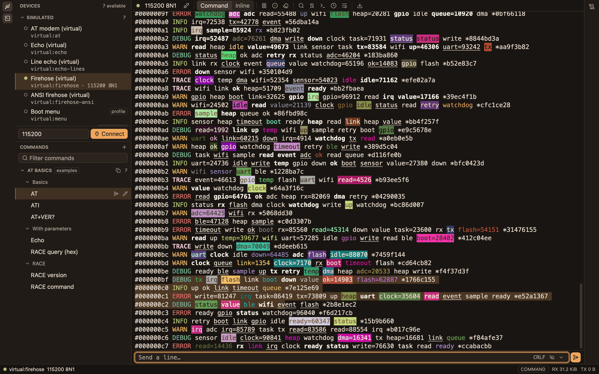<br><sub><b>Ember</b></sub></td>
<td width="25%" valign="top">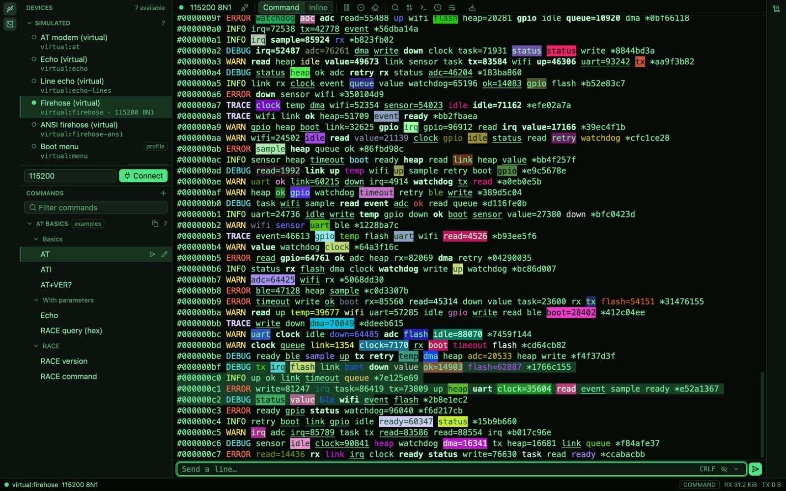<br><sub><b>Phosphor</b></sub></td>
<td width="25%" valign="top">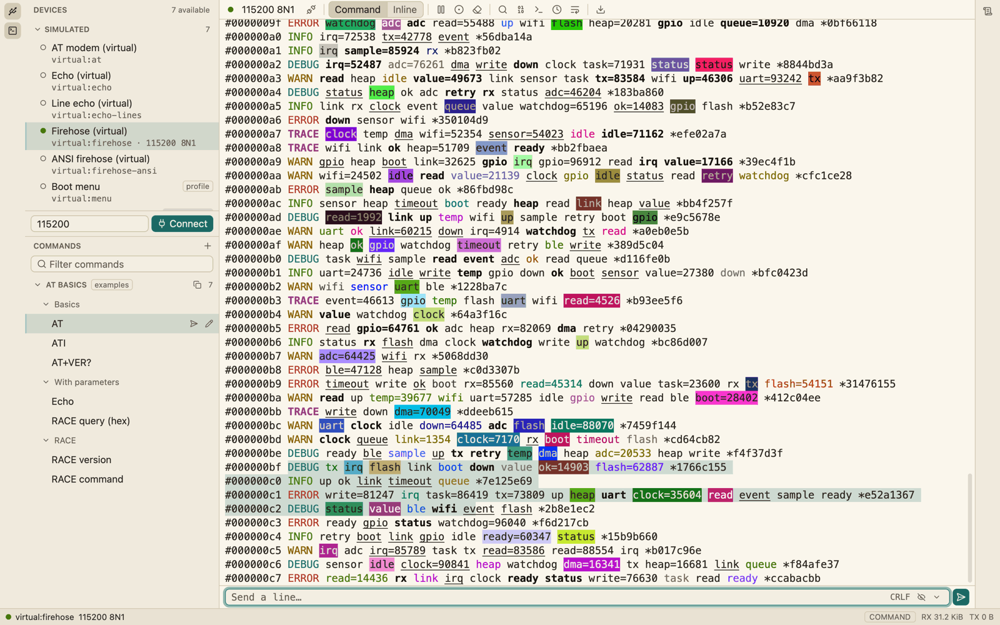<br><sub><b>Paper</b></sub></td>
<td width="25%" valign="top">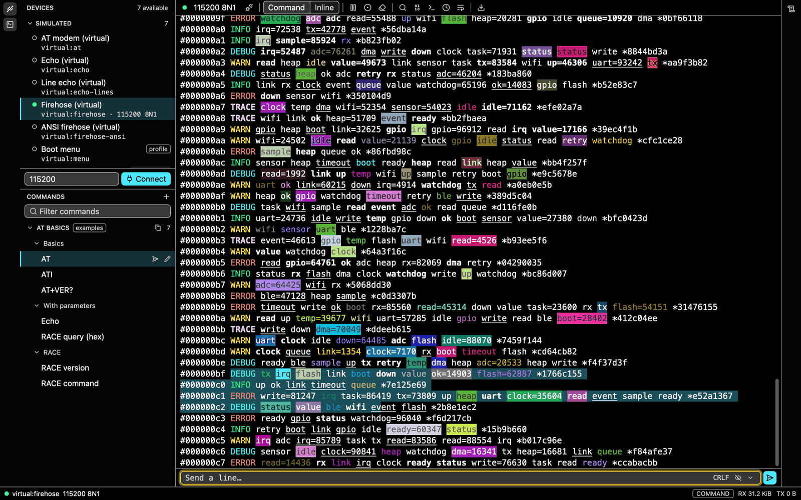<br><sub><b>Contrast</b></sub></td>
</tr>
</table>

Four of the other bundled themes; the Fadetouched family by Arishawke ships too, and Zed
theme files load unchanged.

These pictures are the real workspace, drawn offscreen against Serialist's simulated devices by
`just screenshots` (macOS; it writes twenty-two states to `target/screenshots/`).

## Quick start

```sh
cargo run --release -p serialist -- --virtual at
```

Build from a checkout: the toolchain is pinned in `rust-toolchain.toml`, `CONTRIBUTING.md`
lists the prerequisites, and the first build compiles GPUI and takes several minutes.
Packages for macOS, Linux and Windows are under [Installing a release](#installing-a-release).

`--virtual at` opens a simulated AT modem next to your real ports, so everything works with
no hardware attached (it answers `AT` with `OK`); `echo`, `echo-lines`, `firehose`,
`firehose-ansi`, `race` and `menu` (a boot menu, for VT mode) are the other simulated
devices. To open a real port, pick it in the Devices panel, or start with
`--port /dev/cu.usbserial-1420 --baud 115200`. A TCP stream is `--port tcp:host:4000` and a
recorded capture `--port replay:boot.bin`. [`docs/manual.md`](docs/manual.md) has every flag
and port form.

## The window

Devices and Commands in the left dock, the session in the middle, the Decoded panel and the
Script console in the right dock, the status bar along the bottom. The session toolbar is one
row of icons, each with its shortcut in its tooltip, and `cmd-shift-p` opens the command
palette: every action, saved command and script, filtered as you type.

- **Two ways to send.** Command mode has the compose bar and the saved commands, which take
  parameters, an expected reply and a key. Inline mode (`cmd-i`) sends every key to the port;
  `ctrl-]` comes back.
- **Two ways to look.** Monitor mode is a log of every line received, with search, a hex
  view and timestamps. VT mode (`alt-v`) is a terminal screen the device draws on, for a
  `bootmenu`, a Linux console or `top`; the log keeps recording underneath. Try it with
  `--virtual menu`.
- **Tabs.** One per open port (`cmd-t`, `cmd-w`, `cmd-1` to `cmd-9`). Background tabs keep
  receiving, recording and running their scripts, and the open tabs come back at the next
  start.
- **Record and replay.** Record (`cmd-shift-r`) writes the raw bytes and a `.timing` sidecar
  beside them; `replay:<file>` plays a capture back at its original pace, in a tab like any
  port.
- **Settings.** `cmd-,` opens a Settings tab, a front end to `settings.json` and `keymap.json`,
  which stay the source of truth. Everything lives in `~/.config/serialist`
  (`%APPDATA%\Serialist` on Windows): settings with Zed's key names, Zed-format themes and
  keymaps, saved commands, scripts and plugins, applied the moment a file is saved.

The rest, from the port settings popover to what a restored `tcp:` tab does at startup, is
in [`docs/manual.md`](docs/manual.md). `CHANGELOG.md` says what each release shipped.

## Keyboard

The bindings worth knowing, on macOS. Linux and Windows mostly use `ctrl-shift` chords, since
plain `ctrl` chords belong to the device in inline mode; the full table for every platform,
and what inline mode sends instead of running, is in [the manual](docs/manual.md#keyboard).
Your own `keymap.json`, in Zed's format, is applied after the defaults.

| Key | Action |
|---|---|
| `cmd-shift-p` | Command palette |
| `cmd-,` | Settings |
| `cmd-t`, `cmd-w`, `cmd-1` to `cmd-9` | New tab, close tab, go to a tab |
| `cmd-shift-w` | Disconnect (Connect in the toolbar opens the port again) |
| `cmd-i` | Inline mode on and off |
| `alt-v` | VT mode on and off |
| `cmd-f`, `alt-h`, `alt-t`, `alt-z` | Search, hex view, timestamps, wrap |
| `cmd-p`, `cmd-shift-r`, `cmd-s`, `cmd-k` | Pause, record, export, clear |

## Scripting

Lua 5.4 scripts run on their own thread against the open session, so a script that waits
for the device never blocks the window:

```lua
local port = assert(serial.current())
port:write("AT\r\n")
print(port:expect("^OK$", { timeout_ms = 1000 }) and "device is up" or "no answer")
```

Start one from the Script console or the Scripts menu, from a key binding, from a saved
command whose payload is `{ "script": "version_probe.lua" }`, from a device profile's
`on_connect`, or with no window at all: `serialist --port virtual:at --script version_probe.lua`
exits 0, 1 or 2. Two example scripts ship with the app. The API, the sandbox and the triggers
are in [`docs/scripting.md`](docs/scripting.md).

## Plugins

A plugin is a codec: it frames the received bytes into structured frames for the Decoded
panel and the log, and encodes structured commands into bytes to send. None is built in. A
plugin is a folder in the config directory's `plugins/`, registered under the folder's
name, holding `plugin.lua`, or `plugin.wasm` with `plugin.toml` (WebAssembly plugins need a
build with the `wasm` feature, off by default because wasmtime adds minutes to a clean
build). Copying the folder in enables it; deleting it removes it.

The app ships an Airoha RACE plugin as its example, in Lua and WebAssembly. Install it from
the command palette ("Install example plugin: Airoha RACE"), then `serialist --virtual race`,
pick `airoha-race` in the codec menu and send "RACE version" from the Commands panel.

<p align="center">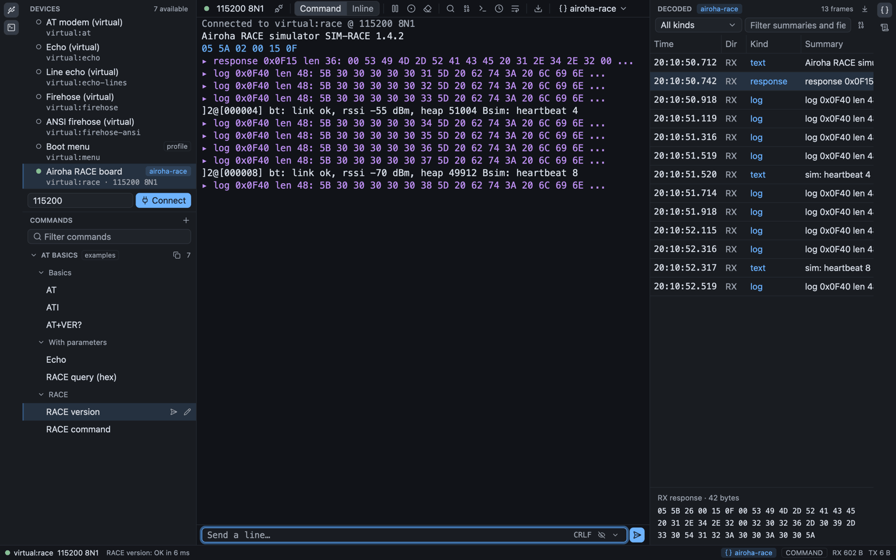</p>

<p align="center"><sub>The Airoha RACE example plugin on the simulated board (<code>--virtual race</code>): one line per frame in the log, the parsed frames in the Decoded panel, the selected one as hex.</sub></p>

A device profile's `"plugin"` picks the codec for a port, and a saved command's payload can
be a frame for the codec to encode. Writing a plugin, and everything the app does with one,
is in [`docs/plugins.md`](docs/plugins.md).

## Installing a release

Release builds are attached to
[GitHub Releases](https://github.com/TheBigShoe/serialist/releases): a `.dmg` for macOS
(Apple Silicon), a `.tar.gz` and a `.deb` for Linux (x86_64), and an `.msi` for Windows
(x86_64). `SHA256SUMS` lists the checksums. **None of them are code-signed yet**, so each
OS warns on first launch:

- **macOS.** Open the `.dmg` and drag Serialist to Applications. The app is signed ad hoc
  but not with an Apple Developer ID and not notarized, so Gatekeeper refuses it at first
  ("Apple could not verify..."). Either Control-click Serialist in Applications, choose
  Open, and confirm (macOS 14 and earlier); or try to open it once, then go to System
  Settings, Privacy & Security, and press Open Anyway next to the Serialist notice
  (macOS 15 and later); or clear the download flag in Terminal:
  `xattr -dr com.apple.quarantine /Applications/Serialist.app`.
- **Windows.** SmartScreen shows "Windows protected your PC". Choose More info, then Run
  anyway. Installing from the `.msi` puts Serialist in Program Files and the Start menu;
  the Customize page has an option to add it to `PATH`.
- **Linux.** `sudo apt install ./serialist_*.deb`, or unpack the `.tar.gz` and run
  `./install.sh` (installs to `~/.local`). The `.deb` pulls in what it needs; for the
  tarball install the Vulkan loader and a Vulkan-capable GPU driver, xkbcommon
  (`libxkbcommon`, `libxkbcommon-x11`), fontconfig, libudev, and the Wayland or X11 client
  libraries (Debian and Ubuntu: `libvulkan1 libxkbcommon0 libxkbcommon-x11-0 libfontconfig1
  libudev1 libwayland-client0 libx11-xcb1`). To open serial ports, join the group that owns
  them (`dialout` on Debian and Ubuntu).

To build the packages yourself, see `docs/releasing.md`.

## License

Licensed under either of Apache License, Version 2.0 (`LICENSE-APACHE`) or MIT license
(`LICENSE-MIT`) at your option. Contributions are accepted under the same terms.

The bundled Fadetouched themes are by Arishawke and under the MIT license, not Serialist's own
terms; their copyright and license text are in `THIRD_PARTY_LICENSES.md`, which every package
includes.
